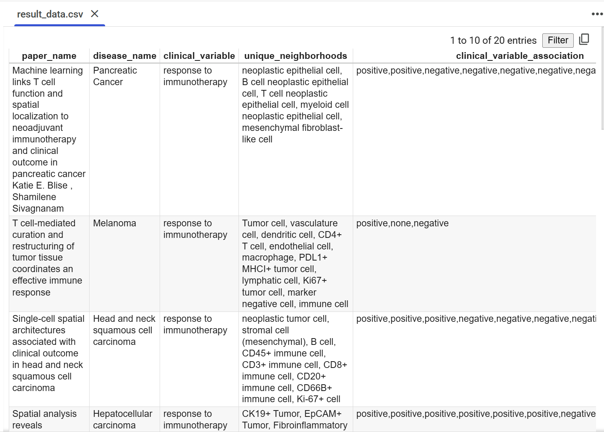

Project 1: NLP-Based Extraction of Cellular Niches (Machine Learning & AI) 
Objective:
The goal of this project is to extract crucial information from medical research papers and curate a structured dataset to reduce the time needed to understand the overview of an article.
Notebook: Cellular_Niche_Extraction_using_OpenAILLM

Dataset Design:
The curated dataset contains:

Title of the article

Disease name

Clinical variable

Unique neighborhoods (contexts/conditions)

Associations between clinical variables and neighborhoods

Approach and Techniques:

Title Extraction:

Bypassed the use of GPT models for title extraction.

PyMuPDF proved to be significantly more efficient and accurate in extracting titles compared to GPT-based methods.

Information Retrieval:

A pure baseline approach and one-shot chain-of-thought prompting without Retrieval-Augmented Generation (RAG) were effective in retrieving disease names and clinical variables.

Neighborhood and Association Extraction:

A combination of pure baseline, one-shot chain-of-thought, and RAG techniques achieved the best performance for extracting unique neighborhoods and clinical variable associations.

Key Findings:

Title extraction is more reliable using traditional PDF parsing libraries like PyMuPDF than with GPT models.

Chain-of-thought prompting without RAG works well for direct information retrieval (disease names, clinical variables).

RAG improves performance when the task requires deeper association extraction (e.g., relationships between variables and conditions).associaltion 

